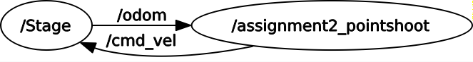

ESA-ROS Assignment 2
--------------------

Minh-Triet Diep, Lars Jaeqx

# Code explanation

## Point and shoot  
We first started with calculating the angle we need to turn to face the coordinates we want to travel to. This happens in the `cbGoal` callback. We have our own position and the goal position, and with some goniometry we can calculate the heading we need. This boils down to `angle = atan(dy, dx)`, with dy and dx being the distance between the robot and the goal we get from the message.

We also have the robot's existing rotation, so we need to figure out what to turn to reach that angle we calculated earlier. In the first versions of the program, we simply substracted the angles to get the final rotation, and determined which direction to turn if the difference between them is positive or negative. This proved to make it turn unnecessarily much, so we figured out we needed to get the smallest angular distance between two angles. We used a function from Stackoverflow before we discovered this was something in the ROS library, so that code is still used.

With that, we managed to get it to turn to the goal with the smallest rotation needed. After that, we need to do the "shoot" part. This is relatively simple, as we use Pythagoras' theorem to get the distance. With this, we managed to get point-and-shoot working. The final part, rotating with the `orientation` part of the `pose` wasn't much trouble after applying what we had from the original rotation part. We did have some trouble making the orientation part of the message, so we used this on-line calculator to figure out the quaternion for the euler system we know: http://www.andre-gaschler.com/rotationconverter/

This concludes "Point and shoot".

## Servoing

We worked from the `Point and Shoot`.

# Running instructions  

As with the previous assignment, the steps are similar to get the program started:

```sh
cd ~/catkin_ws
catkin_make
source devel/setup.bash
roslaunch assignment2 assigment2_point.launch
rostopic pub -1 /goal geometry_msgs/PoseStamped '{header: {stamp: now, frame_id: "map"}, pose: {position: {x: 1.0, y: 1.0, z: 0.0}, orientation: {x: 0.0, y: 0.0, z: 1.0, w: 0.0}}}'
```

# Tests and Observations  

## Point and shoot  
[Results on YouTube: https://www.youtube.com/watch?v=CsxywmbSKs4](https://www.youtube.com/watch?v=CsxywmbSKs4)

As you can see, the point-and-shoot method works reasonably well. Also visible is that once you need to go to the same coordinate you just went to, the robot does a small correction. This is because point-and-shoot has an inherent inaccuracy. We needed to use this [rotation converter](http://www.andre-gaschler.com/rotationconverter/) to figure out the rotation in quaternions, as is visible.

## Servoing  

Things!

# Graph 

## Point and shoot



## Servoing

Things!