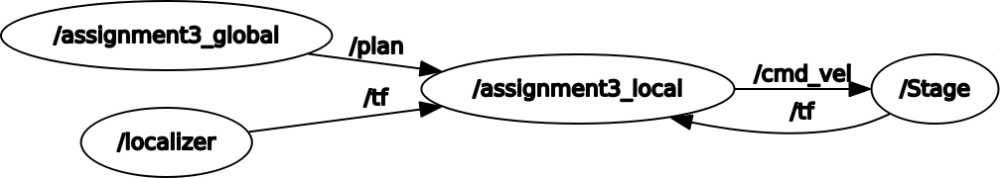

ESA-ROS Assignment 3
--------------------

Minh-Triet Diep, Lars Jaeqx

# Code explanation

## Global planner  
For this assignment we have to make two global planners. One has to follow a rectangular path and the other has to make a triangular path. We have to advertise this path to the `/plan` topic.  
  
The `/plan` contains a vector with `geometry_msgs::PoseStamped` of the waypoints we have to follow. In `makePath` we fill the vector with the waypoints.

## Local planner (follow the carrot)  
The local planner was a bit more complex. First we tried to think about how to nicely be able to follow a virtual carrot. Drawing a circle with a radius of the look-ahead distance, and finding the intersections on the path gave us two points. One of these points, the one closest to the "next goal" is the one we want to follow.

We tried to calculate this by ourselves instead of using some library, for a nostalgic throwback to high school. Sadly we made a series of mistakes, so we spent a whole day on calculating these intersections. The errors we made are sloppy, forgetting to square several terms and just miscalculations.

We used the *Quadratic Formula* to get the intersections of the path and the lookahead circle. The formula of the circle is (x-robotposition.x)^2 + (y-robotposition.y) = lookahed^2

After that worked, we also had trouble getting the robot to follow the calculated point, caused by how the difference between the `x>pi` and `x<-pi` being larger than `pi`, but this was solved by applying the fix in the error calculation, and not to the positions and targets.

<leg implementatie uit Lars>

# Running instructions  

As with the previous assignments, the steps are similar to get the program started:

```sh
cd ~/catkin_ws
catkin_make
source devel/setup.bash
roslaunch assignment3 assigment3_triangle.launch
```

To run the rectangle path just replace the last line to this:

```sh
roslaunch assignment3 assigment3_rectangle.launch
```

# Tests and Observations  

Clean demo:
https://www.youtube.com/watch?v=upIzUatskR0

We can see the robot moving along the path is was given, creating a triangle or a square.

Now we wanted to make shure that the robot still follows it's path if it's moved by the user, so we moved the robot in the visualizer and we can see the robot moving back to it's path, even if it's outside of the lookahead distance.

Demoing manual error:
https://www.youtube.com/watch?v=xTyJA5q1sEk

# Graph 

