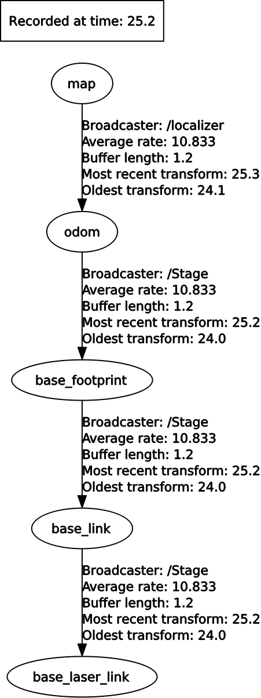

ESA-ROS Assignment 3
--------------------

Minh-Triet Diep, Lars Jaeqx

# Code explanation

## Global planner  
For this assignment we have to make two global planners. One has to follow a rectangular path and the other has to make a triangular path. We have to advertise this path to the `/plan` topic.  
  
The `/plan` contains a vector with `geometry_msgs::PoseStamped` of the waypoints we have to follow. In `makePath` we fill the vector with the waypoints.

## Local planner (follow the carrot)  
The local planner was a bit more complex. First we tried to think about how to nicely be able to follow a virtual carrot. Drawing a circle with a radius of the look-ahead distance, and finding the intersections on the path gave us two points. One of these points, the one closest to the "next goal" is the one we want to follow.

We tried to calculate this by ourselves instead of using some library, for a nostalgic throwback to high school. Sadly we made a series of mistakes, so we spent a whole day on calculating these intersections. The errors we made are sloppy, forgetting to square several terms and just miscalculations.

We used the [*Quadratic Formula*](http://www.purplemath.com/modules/quadform.htm) to get the intersections of the path and the lookahead circle. The formula of the circle is `(x - robotposition.x)^2 + (y - robotposition.y) = lookahead^2` and the formula of the line through two waypoints is `y = a * x + b` where *a* is the magnitude and *b* the offset. To calculate the intersections we substitute the *y* of circle formula with the *y* of the line formula so we get the following formula `(x - robotposition.x)^2 + (a * x + b - robotposition.y) = lookahead^2`. Using the [*Quadratic Formula*](http://www.purplemath.com/modules/quadform.htm) we can calculate the points where the line and circle intersect.

We found out that this doesn't work if the line through two waypoints is vertical. If this happens we have to calculate the *y* instead of the *x* using the [*Quadratic Formula*](http://www.purplemath.com/modules/quadform.htm). We have the same formula for the circle but the formula for the line is just `x = waypoint.x` so now we have to subsitute *x* resulting in the following formula: `(waypoint.x - robotposition.x)^2 + (y - robotposition.y) = lookahead^2`. Now we can do the same trick using the [*Quadratic Formula*](http://www.purplemath.com/modules/quadform.htm).

Most times we retrieve two points from this formula. We have to make sure we follow the right point so we have to check wich point is closest to the waypoint. Now we got the right point on the lookahead circle and can start moving towards this point.

If we dont find a point on the lookahead circle we have to find the shortest way back to the path. We use the line between the two waypoints and calculate the perpendicular line and the distance from the robot to the line. Now we can navigate back to this line and if it's back in range it will start following the line again using the lookahead circle.

After that worked, we also had trouble getting the robot to follow the calculated point. Whenever the angle was flipped between `-pi` and `+pi` the robots behavior became erratic. This is caused by how the difference between the `x>pi` and `x<-pi` being larger than `pi`.  Finally, this was solved by adding `2*pi` or substracting `2*pi` in the error calculation, so the robot turns the shortest angle.

# Running instructions  

As with the previous assignments, the steps are similar to get the program started:

```sh
cd ~/catkin_ws
catkin_make
source devel/setup.bash
roslaunch assignment3 assigment3_triangle.launch
```

To run the rectangle path just replace the last line to this:

```sh
roslaunch assignment3 assigment3_rectangle.launch
```

# Tests and Observations

We chose for YouTube videos instead of screencaps, because the trails weren't very clearand interaction with Stage removed the trials. 

Clean demo:
https://www.youtube.com/watch?v=upIzUatskR0

We can see the robot moving along the path that was given, creating a triangle or a square.

Now we wanted to make sure that the robot still follows it's path if it's moved by the user, so we moved the robot in the visualizer and we can see the robot moving back to it's path, even if it's outside of the lookahead distance.

Demoing manipulating robot:
https://www.youtube.com/watch?v=xTyJA5q1sEk

# Graph 


# TF tree


