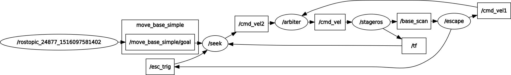

Assignment 7
=========

Minh-Triet Diep, Lars Jaeqx

# Code explanation

This assignment was cloned from the [mines-ros](https://github.com/fhict/mines-ros) repository as a starting point. The first step was to make the arbiter.

`arbiter.cpp`
-------------

We wrote the arbiter to subscribe on several `cmd_vel[x]` topics. The launch file for the behavior is then used to map the `cmd_vel` topics from different nodes to `cmd_vel[x]` with x being the priority. Priority 0 is the highest, and priority 2 is the lowest. 

To differentiate from each priorities' `Twist` messages we created a small wrapper struct which adds a priority member. Each time the arbiter receives an updated `cmd_vel` from any topic, the local priority message is updated. This only happens if the saved priority is lower than what we just received. The rate is set to 100, and each tick the arbiter is updated, which publishes the current relevant `cmd_vel`. This also resets the priority to accept all priorities again. With this, the arbiter functions nicely with simple code.

`seek_behavior.cpp`
-------------------

We took the carrot follower from assignment 3 and used that as our seek behavior. We then added another priority and put the seek behavior in between cruise and recovery behavior. As we found the cruise behavior to be annoying we disabled that in the launch file. 

The carrot follower was modified to accept a `PoseStamped` goal instead of a `Path`, and the carrot follower was made to simply go to the point. Due to how the requirements specify we can't use any navigation stack components and can't use any mapping, this simple move-and-bump-and-escape behavior wasn't sufficient to get the robot out of the first obstacle, so we added a new subscriber to the `esc_trig` topic. We modified `escape_behavior` to publish this once the escaping was done. This way, we keep updating the starting point so the path keeps changing after each escape, giving more probability that the robot moves out of the way.

We did need to make the robot correct slower in the carrot following behavior, otherwise the robot "followed" the line into the wall every time "correctly".

Finally every time the goal is updated the node does correctly follow that.

`escape_behavior.cpp`
---------------------

As described above we added a simple topic publisher to notify that the escaping is finished. We did try to make the escaping smarter by making it rotate in the opposite direction of the closest obstacle, but due to how well our original carrot follower works this counteracted each other. We then reverted this back to a single-direction escape behavior.

Other changes
-------------

We set the `escape_behavior` node to reverse more and to rotate more. This is to help the chance for the robot to get out of a blockade better.

We also disabled the cruising behavior after we implemented the seeking, as it was annoying during testing and wasn't active while a goal was given anyway. 


Running instructions  
--------------------

As with the previous assignments, the steps are similar to get the program started:

```sh
cd ~/catkin_ws
catkin_make
source devel/setup.bash
roslaunch stage_behavior behavior.launch
rostopic pub /move_base_simple/goal geometry_ms/PoseStamped '{header: {stamp: now, frame_id: "map"}, pose: {position: {x: 0.0, y: 6.0, z: 0.0}, orientation: {w: 1.0}}}'
```

Tests and Observations
----------------------

During the test we changed the parameters `backoff_duration`, `backoff_velocity`, `turn_duration`, `turn_velocity` and `bump_distance` in the launchfile in order to find the best values. In the seek_behavior node we tweaked the `maxSpeed`, `lookAhead`, `tolerance`, `gain` and `pow` to correct slower.

During testing we saw the robot behaving like we expected, but not in the optimal way.

This is that result: [Video](https://streamable.com/5s03o)

We think it could've worked much better with some path planning, but that was outside the scope of the requirements.

Graph
-----



The cruise behavior has been disabled for the test and thus doesn't show up.
